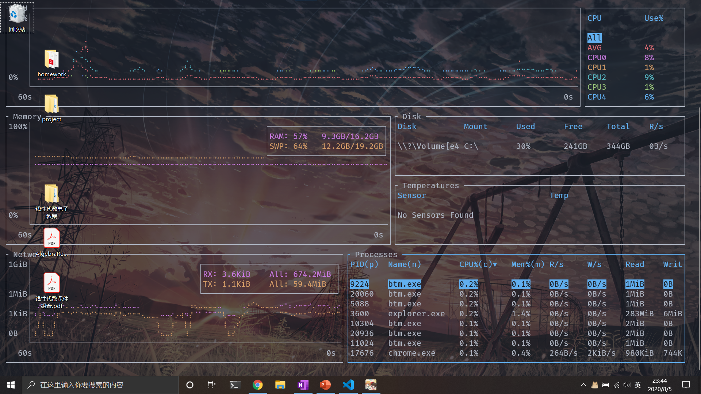

# Bottom Wallpaper

让 [bottom](https://github.com/ClementTsang/bottom) 变成你的壁纸

## 安装

安装 Windows terminal 和 bottom，并为 Windows terminal 配置一个名为 Bottom 的 Profile。你可以为这个 Profile 配置背景图片来作为你的壁纸。

然后编译本项目：

```
g++ bottom-wallpaper.cxx utils.cxx -o bottom-wallpaper
```

运行 `bottom-wallpaper` 即可

## 截图


